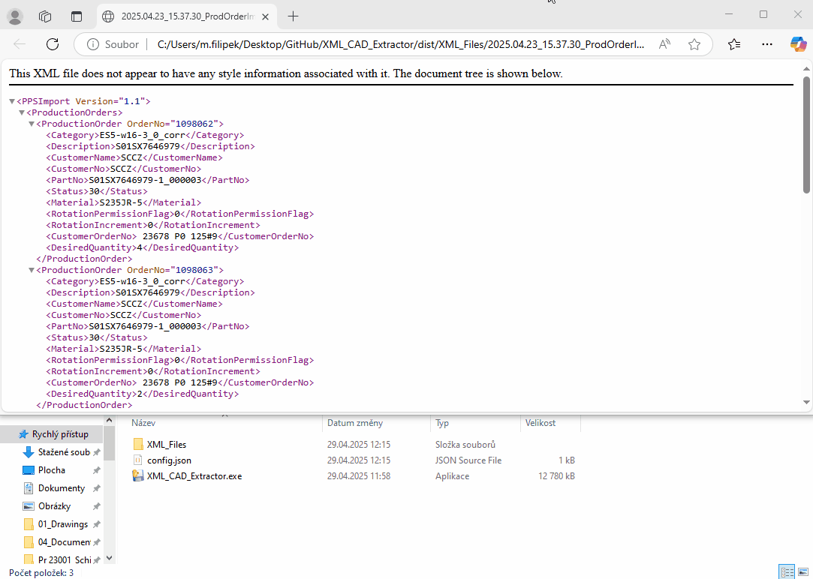

# About Me 👋

🚀 Manufacturing Technologist transitioning into IT Development with a passion for Python, data, and AI. 

After falling in love with coding, I've dedicated 500+ hours to structured learning and personal projects. Now I'm looking to turn my passion into profession!

## 🛠️ Technical Journey
- ✅ Completed **Python Programming MOOC 2024** (270 hours) - mastered OOP, algorithms, and software development principles
- 📊 Completed - awaiting reults of **Data Analysis with Python 2024-2025** (135 hours) - focusing on Pandas, NumPy, and Machine Learning
- 🔜 Future focus: **More Machine Learning & AI** - excited about intelligent systems and their real-world applications

## 📜 Certifications
- [Python Programming MOOC 2024 Certificate](https://certificates.mooc.fi/validate/x1s80pljmp) - [Copy of the certificate (if validated certificate on MOOC doesn't work](https://github.com/Groonst/Groonst/blob/main/assets/Python%20Programming%20MOOC%20Certificate.pdf)

## 🌟 What I Bring to the Table
- **Problem-solving mindset** from manufacturing technology applied to coding challenges
- **Analytical skills** that translate well to data processing and algorithm design
- **Self-motivation** demonstrated by completing intensive courses while working full-time
- **Continuous learning** attitude - constantly expanding my tech stack

## 🎯 2025 Goals
- Land my first professional developer role
- Start my Bachelor's degree in Computer Science
- Contribute to open source projects
- Build a portfolio of 5+ substantial projects
- Network with the tech community

## 📫 Let's Connect!
I'm always open to:
- Collaborations on interesting projects
- Learning opportunities and mentorship
- Discussions about tech and career transitions

## 🚀 My Projects

### Stroke risk factors analysis (Data science project)
**Python | Pandas | Statistical Analysis | Data Visualization | Jupyter Notebook**

🔗 [GitHub Repository](https://github.com/Groonst/Stroke_analysis)

A comprehensive statistical analysis of stroke risk factors using healthcare data, demonstrating data science skills and ability to derive clinically relevant insights.

**Key Findings:**
- Age is the strongest predictor (median 71 vs 43 years, p<0.001)
- Elevated glucose levels increase risk (+15% median, p<0.001)
- Hypertension patients have 3.3× higher stroke prevalence
- Heart disease patients show 4.1× higher stroke occurrence

**Analysis Features:**
- Automated data cleaning (BMI imputation, categorical conversion)
- Advanced statistical testing (t-tests, chi-square)
- Publication-quality visualizations (Seaborn/Matplotlib)
- Clinical significance evaluation (-log10 p-values)
- Presentation-ready output formatting

**What It Demonstrates:**
- Proficiency in Python data science stack (Pandas, NumPy, SciPy)
- End-to-end statistical analysis capabilities
- Ability to translate technical findings into actionable insights
- Strong data visualization skills
- Professional results presentation

**Clinical Recommendations:**
- Prioritize screening for patients >70 years (3× higher risk)
- Aggressive blood pressure control for hypertensive patients
- Annual glucose checks for patients >50 years
- Enhanced cardiac monitoring for heart disease patients

**Analysis screenshots:**

  

---

### Maze Game (Python Game Development)
**Python | PyGame | OOP | Game Logic**

🔗 [GitHub Repository](https://github.com/Groonst/Maze_Game)

A complete maze adventure game developed as part of my Python studies, showcasing my object-oriented programming skills and creative approach to assignments.

**Game Features:**
- 5 challenging levels with increasing difficulty
- Collectible coins and dangerous monsters
- Lives system and scoring mechanism
- Different monster behaviors (vertical, horizontal, CCV patterns)
- Level completion requirements

**Technical Implementation:**
- Clean OOP architecture with separated Level and Game classes
- Collision detection system
- Sprite animation and movement logic
- Game state management (win/lose conditions)
- Custom image processing (color inversion for monsters)

**What It Demonstrates:**
- Ability to work with PyGame library
- Understanding of game loops and event handling
- Problem-solving in implementing game mechanics
- Creativity in expanding basic assignment requirements

**Maze Game Demo:**

  

---

### XML CAD Extractor (Professional Utility Tool)
**Python | XML Processing | Data Extraction | File Management**

🔗 [GitHub Repository](https://github.com/Groonst/XML_CAD_Extractor)

A sophisticated production data extraction tool I developed to streamline manufacturing workflows. This utility demonstrates my ability to create practical solutions for real-world problems.

**Key Features:**
- Extracts CAD file references and material data from production XML files
- Interactive console interface with configurable settings via JSON
- Intelligent file management with automatic folder creation
- Data validation and error handling for production orders
- Generates standardized output XML for system integration

**Technical Highlights:**
- Uses `lxml` for efficient XML parsing and generation
- Implements configurable paths and settings via JSON
- Features comprehensive file system operations
- Includes user-friendly input validation
- Demonstrates clean code architecture with separated functions

**Professional Relevance:**
- Shows my ability to bridge manufacturing and IT domains
- Demonstrates problem-solving in industrial environments
- Highlights my understanding of production data workflows

**XML CAD Extractor Demo:**

  

---
Groonst@gmail.com | [Linkedin Profile](https://www.linkedin.com/in/michal-filipek-4b6192161)
